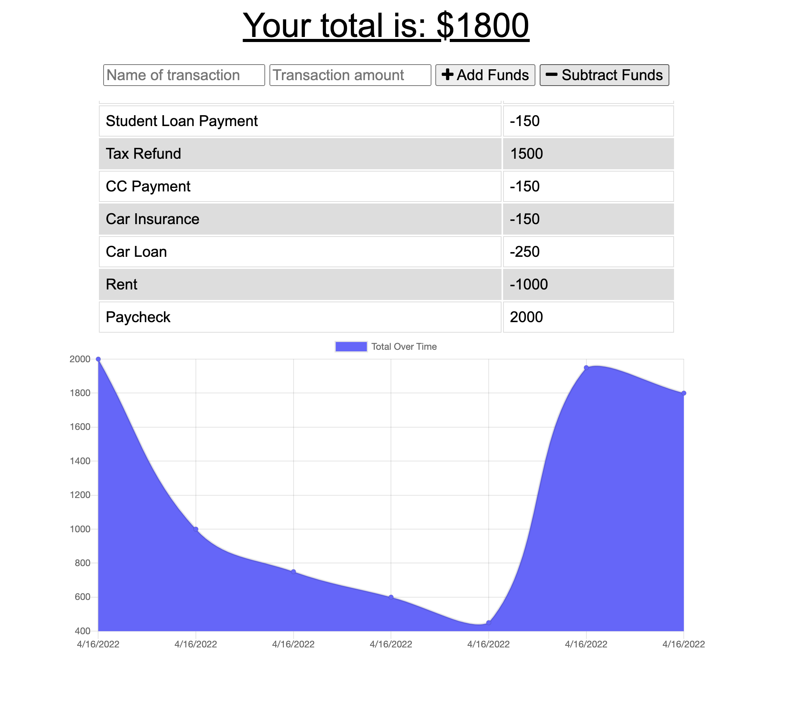

# budgy
Budget Tracker

## Description
This is a single page web application for tracking a personal budget.  

## Table of Contents
* [Usage](#usage)
* [Photo](#photo)
* [License](#license)
* [Contributing](#contributions)
* [Tests](#tests)
* [Questions](#questions)

## Usage
This application is deployed to Heroku and ready to use. 

## Photo

## License
None

## Contributing
This application is not open-source at this time. Feel free to fork or clone the repo to further develop this application for your own use!

## Tests
No testing required

## Additional Info
* Github: [kalecodes](https://github.com/kalecodes)
* Heroku Deployment: [Budgy](https://budgy-budget-tracker.herokuapp.com/)